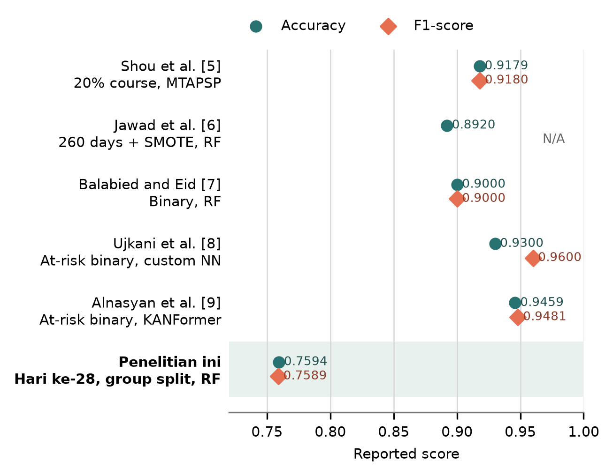

# IV. Results and Discussion

## A. Dataset and Validation Results

Dataset hasil preprocessing memuat 32.593 student-module-presentation dari 28.785 mahasiswa unik. Kelas `AtRisk` berjumlah 17.208 baris dan kelas `Successful` berjumlah 15.385 baris. Train-validation memuat 26.122 baris, sedangkan hold-out test memuat 6.471 baris dengan 3.398 kasus `AtRisk` dan 3.073 kasus `Successful`. Pemisahan berbasis `id_student` menghasilkan overlap mahasiswa sebesar nol. Missing value terutama terdapat pada `imd_band` dan sebagian kecil `date_registration`; keduanya ditangani di dalam pipeline berdasarkan data pelatihan pada setiap fold.

## B. Cross-Validation Performance

Tabel I menunjukkan hasil 5-fold GroupKFold. Random Forest menghasilkan mean recall `AtRisk` tertinggi sebesar 0,7107 dan dipilih sebagai model final sesuai kriteria seleksi. XGBoost menghasilkan accuracy, F1-score, dan ROC-AUC tertinggi, masing-masing sebesar 0,7584, 0,7522, dan 0,8440.

**Table I. Hasil 5-Fold GroupKFold pada Train-Validation**

| Metrik | Logistic Regression | Random Forest | XGBoost |
|---|---:|---:|---:|
| Accuracy | 0,7496 ± 0,0039 | 0,7524 ± 0,0013 | **0,7584 ± 0,0024** |
| Precision AtRisk | 0,8090 ± 0,0059 | 0,7989 ± 0,0136 | **0,8215 ± 0,0096** |
| Recall AtRisk | 0,6889 ± 0,0064 | **0,7107 ± 0,0085** | 0,6938 ± 0,0029 |
| F1 AtRisk | 0,7442 ± 0,0059 | 0,7521 ± 0,0030 | **0,7522 ± 0,0039** |
| ROC-AUC | 0,8330 ± 0,0027 | 0,8362 ± 0,0023 | **0,8440 ± 0,0019** |

## C. Hold-Out Test Performance

Pada hold-out test, Random Forest mencapai accuracy 0,7594, precision `AtRisk` 0,8007, recall 0,7213, F1-score 0,7589, dan ROC-AUC 0,8396. XGBoost menghasilkan accuracy dan ROC-AUC tertinggi, sedangkan Random Forest mempertahankan recall `AtRisk` tertinggi. Dari 3.398 kasus `AtRisk`, Random Forest mengenali 2.451 kasus dan melewatkan 947 kasus.

**Table II. Performa Model pada Hold-Out Test**

| Metrik | Logistic Regression | Random Forest | XGBoost |
|---|---:|---:|---:|
| Accuracy | 0,7487 | 0,7594 | **0,7611** |
| Precision AtRisk | 0,8034 | 0,8007 | **0,8154** |
| Recall AtRisk | 0,6904 | **0,7213** | 0,7045 |
| F1 AtRisk | 0,7426 | **0,7589** | 0,7559 |
| ROC-AUC | 0,8311 | 0,8396 | **0,8443** |

Fig. 1 membandingkan metrik ketiga model, Fig. 2 menunjukkan confusion matrix Random Forest, dan Fig. 3 menyajikan kurva ROC. Ketiga model memiliki kurva ROC yang berdekatan. Pemilihan Random Forest mengikuti tujuan early warning yang menempatkan cakupan deteksi `AtRisk` sebagai prioritas model selection.

## D. Feature Importance

Kontribusi fitur Random Forest didominasi sinyal perilaku awal. Total klik VLE, hari aktivitas terakhir, jumlah hari aktif, dan ragam situs yang diakses muncul sebagai prediktor teratas, diikuti fitur assessment dan registrasi. Nilai importance menunjukkan kontribusi prediktif global; interpretasi hubungan sebab akibat memerlukan desain penelitian kausal.

## E. Benchmark with OULAD Studies

Fig. 5 menempatkan hasil penelitian dalam konteks lima studi OULAD. Shou et al. memakai target biner yang sama pada 20% durasi course [5]. Jawad et al. menggunakan data sampai 260 hari dan SMOTE [6], Balabied dan Eid menggunakan Random Forest [7], sedangkan Ujkani et al. [8] dan Alnasyan et al. [9] menggabungkan `Fail` serta `Withdrawn` sebagai kelompok at-risk. Grafik menyajikan nilai yang dilaporkan setiap studi sebagai benchmark kontekstual karena horizon, split, balancing, dan model yang digunakan berbeda.

## F. Knowledge-Based Risk Layer and BI Output

Threshold kuartil bawah train-validation adalah skor assessment 0, jumlah assessment 0, total klik VLE 47, dan hari aktif VLE 4. Knowledge layer menghasilkan 1.816 `High Risk`, 1.979 `Medium Risk`, dan 2.676 `Low Risk`. Ketika `High Risk` serta `Medium Risk` dipetakan sebagai alarm `AtRisk`, recall meningkat dari 0,7213 menjadi 0,7866; precision berubah dari 0,8007 menjadi 0,7043. Perubahan tersebut memperluas cakupan alarm dan menambah kebutuhan verifikasi stakeholder.

**Table III. Perbandingan Model dan Knowledge-Based Risk Layer**

| Metrik | Random Forest | RF + Knowledge Layer |
|---|---:|---:|
| Accuracy | **0,7594** | 0,7146 |
| Precision AtRisk | **0,8007** | 0,7043 |
| Recall AtRisk | 0,7213 | **0,7866** |
| F1 AtRisk | **0,7589** | 0,7432 |

Dashboard pada Fig. 6 mengidentifikasi 3.795 student-module-presentation dalam antrean `High Risk` atau `Medium Risk`. Sinyal terbanyak adalah skor assessment rendah dengan 2.341 kasus. Daftar prioritas memuat identitas anonim, module-presentation, probabilitas `AtRisk`, level, jumlah sinyal, alasan, dan rekomendasi. Struktur ini menghubungkan evaluasi teknis dengan monitoring module-presentation dan tindak lanjut tingkat mahasiswa.

