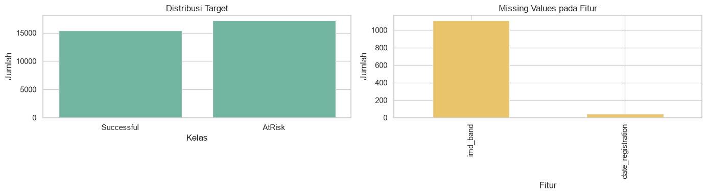
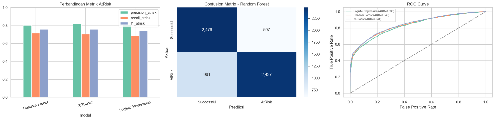

# IV. Results

## A. Dataset and Validation Results

Dataset hasil preprocessing memuat 32.593 student-module-presentation dari 28.785 mahasiswa unik. Kelas `AtRisk` berjumlah 17.208 baris dan kelas `Successful` berjumlah 15.385 baris. Train-validation memuat 26.122 baris, sedangkan hold-out test memuat 6.471 baris dengan 3.398 kasus `AtRisk` dan 3.073 kasus `Successful`. Pemisahan berbasis `id_student` menghasilkan overlap mahasiswa sebesar nol.

Fig. 1 memperlihatkan bahwa distribusi target relatif berimbang. Missing value terkonsentrasi pada `imd_band` dan sebagian kecil pada `date_registration`; keduanya ditangani di dalam pipeline berdasarkan data train-validation.

## B. Cross-Validation Performance

Tabel I menunjukkan rata-rata hasil 5-fold GroupKFold. Random Forest menghasilkan recall `AtRisk` tertinggi sebesar 0,7126 dan F1-score 0,7536. XGBoost menghasilkan accuracy dan ROC-AUC tertinggi, masing-masing sebesar 0,7582 dan 0,8440. Berdasarkan kriteria pemilihan yang memprioritaskan recall, Random Forest dipilih sebagai model final.

**Table I. Hasil 5-Fold GroupKFold pada Train-Validation**

| Metrik | Logistic Regression | Random Forest | XGBoost |
|---|---:|---:|---:|
| Accuracy | 0,7484 ± 0,0033 | 0,7538 ± 0,0033 | **0,7582 ± 0,0041** |
| Precision AtRisk | 0,8081 ± 0,0063 | 0,7999 ± 0,0148 | **0,8217 ± 0,0093** |
| Recall AtRisk | 0,6871 ± 0,0038 | **0,7126 ± 0,0040** | 0,6931 ± 0,0033 |
| F1 AtRisk | 0,7427 ± 0,0043 | **0,7536 ± 0,0050** | 0,7519 ± 0,0028 |
| ROC-AUC | 0,8324 ± 0,0028 | 0,8362 ± 0,0026 | **0,8440 ± 0,0020** |

## C. Hold-Out Test Performance

Tabel II memperlihatkan performa pada hold-out test. Random Forest mencapai accuracy 0,7592, precision `AtRisk` 0,8032, recall 0,7172, F1-score 0,7578, dan ROC-AUC 0,8396. XGBoost menghasilkan accuracy 0,7633 dan ROC-AUC 0,8440, sedangkan recall `AtRisk` berada pada 0,7054. Logistic Regression menghasilkan recall terendah sebesar 0,6869.

**Table II. Performa Model pada Hold-Out Test**

| Metrik | Logistic Regression | Random Forest | XGBoost |
|---|---:|---:|---:|
| Accuracy | 0,7476 | 0,7592 | **0,7633** |
| Precision AtRisk | 0,8040 | 0,8032 | **0,8186** |
| Recall AtRisk | 0,6869 | **0,7172** | 0,7054 |
| F1 AtRisk | 0,7408 | **0,7578** | **0,7578** |
| ROC-AUC | 0,8298 | 0,8396 | **0,8440** |

Classification report Random Forest menunjukkan precision 0,80, recall 0,72, dan F1-score 0,76 pada 3.398 kasus `AtRisk`. Pada 3.073 kasus `Successful`, precision mencapai 0,72, recall 0,81, dan F1-score 0,76. Weighted average F1-score mencapai 0,76.

Fig. 2 merangkum perbandingan metrik, confusion matrix Random Forest, dan kurva ROC. Confusion matrix menunjukkan 2.437 kasus `AtRisk` terdeteksi dan 961 kasus `AtRisk` belum terdeteksi pada hold-out test. Kedekatan kurva ROC ketiga model konsisten dengan selisih ROC-AUC yang relatif kecil.

Feature importance pada Fig. 3 menunjukkan bahwa total klik VLE, hari aktivitas terakhir, jumlah hari aktif VLE, dan jumlah situs VLE menjadi prediktor teratas. Fitur assessment dan registrasi juga berkontribusi. Nilai importance menunjukkan kontribusi prediktif dalam Random Forest dan tidak menyatakan hubungan sebab akibat.

## D. Knowledge-Based Risk Layer

Threshold kuartil bawah data train-validation adalah skor assessment 0, jumlah assessment 0, total klik VLE 47, dan hari aktif VLE 4. Nilai nol pada indikator assessment menunjukkan bahwa sebagian mahasiswa belum mengumpulkan assessment sampai akhir minggu keempat. Knowledge layer menghasilkan 1.795 `High Risk`, 1.994 `Medium Risk`, dan 2.682 `Low Risk` pada hold-out test.

Tabel III membandingkan Random Forest dengan sistem gabungan. Knowledge layer meningkatkan recall dari 0,7172 menjadi 0,7849. Precision berubah dari 0,8032 menjadi 0,7039, sedangkan accuracy berubah dari 0,7592 menjadi 0,7136. Perubahan tersebut menunjukkan perluasan cakupan deteksi disertai peningkatan jumlah alarm yang memerlukan verifikasi stakeholder.

**Table III. Perbandingan Model dan Knowledge-Based Risk Layer**

| Metrik | Random Forest | RF + Knowledge Layer |
|---|---:|---:|
| Accuracy | **0,7592** | 0,7136 |
| Precision AtRisk | **0,8032** | 0,7039 |
| Recall AtRisk | 0,7172 | **0,7849** |
| F1 AtRisk | **0,7578** | 0,7422 |

## E. Business Intelligence Output

Dashboard mengidentifikasi 3.789 student-module-presentation dalam antrean `High Risk` atau `Medium Risk`. Sinyal paling dominan adalah skor assessment rendah dengan 2.341 kasus. Module GGG presentation 2014J memiliki proporsi prioritas tertinggi pada hold-out test, yaitu 100% kasus `High Risk` atau `Medium Risk`. Indikator tersebut berfungsi sebagai sinyal untuk peninjauan konteks modul dan kapasitas intervensi.

Daftar prioritas menyajikan identitas anonim mahasiswa, module-presentation, probabilitas `AtRisk`, level risiko, jumlah sinyal, alasan, dan rekomendasi. Struktur tersebut menghubungkan hasil model dengan tindakan seperti monitoring akses VLE, pendampingan assessment, serta konseling akademik.

Fig. 4 menyatukan KPI, level risiko, prioritas module-presentation, distribusi probabilitas, sinyal dominan, perbandingan perilaku, confusion matrix, dan trade-off model dengan knowledge layer. Tampilan ini menyediakan ringkasan strategis sekaligus dasar penelusuran prioritas operasional.

