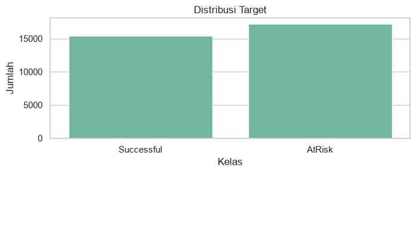
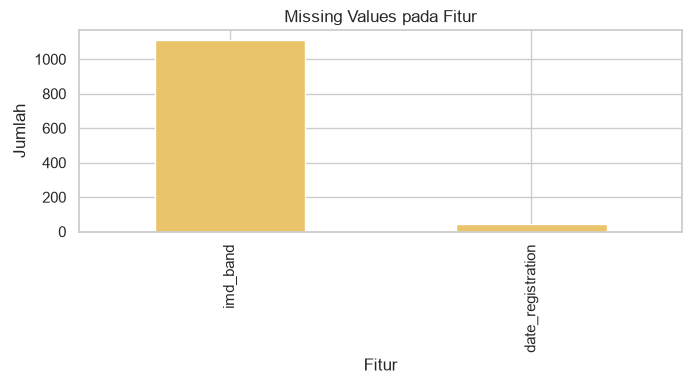
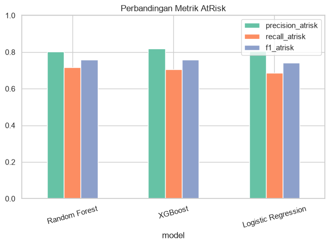
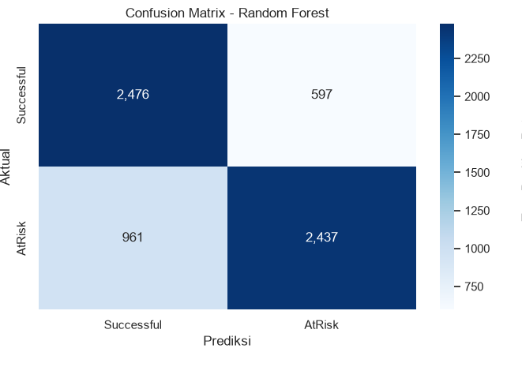
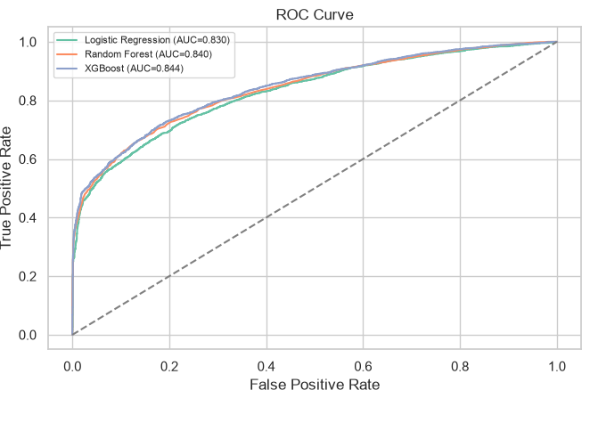
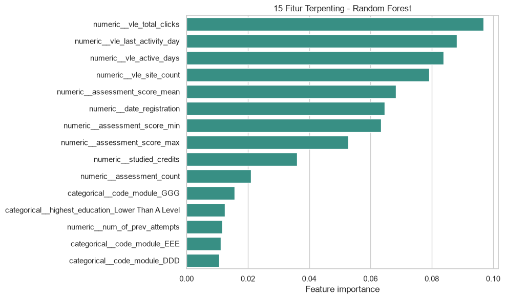
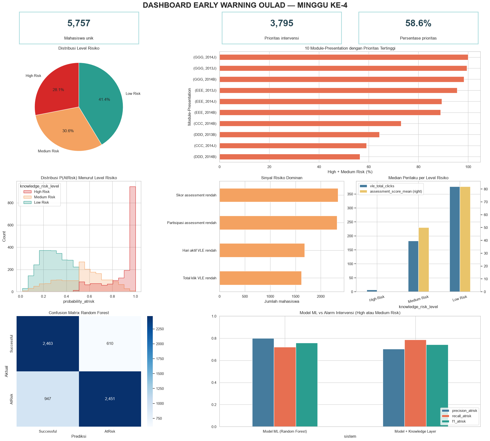

# Artikel IEEE Lengkap

# Early Warning Risiko Dropout Mahasiswa pada Minggu Keempat Menggunakan Supervised Learning dan Knowledge-Based Risk Layer pada Open University Learning Analytics Dataset

Muhammad Rizky Hajar, Alwie Muflich, Heri Santosa, Andi Sunyoto, Robert Marco

Department of Computer Science  
Universitas Amikom Yogyakarta  
Yogyakarta, Indonesia  
Email: riskihajar@students.amikom.ac.id, alwiemuflich@students.amikom.ac.id, heri.sant@students.amikom.ac.id, andi@amikom.ac.id, robert.marco@amikom.ac.id

# Abstract

Dropout mahasiswa memengaruhi keberlanjutan studi, efektivitas layanan akademik, dan pengambilan keputusan institusional. Penelitian ini mengembangkan early warning risiko dropout mahasiswa pada akhir minggu keempat menggunakan Open University Learning Analytics Dataset (OULAD). Target dirumuskan sebagai klasifikasi biner, yaitu `AtRisk` untuk hasil akhir `Withdrawn` dan `Fail`, serta `Successful` untuk `Pass` dan `Distinction`. Fitur prediktor dibentuk dari data demografis, registrasi awal, assessment, dan aktivitas Virtual Learning Environment yang tersedia sampai hari ke-28. Evaluasi membandingkan Logistic Regression, Random Forest, dan XGBoost melalui hold-out test berbasis kelompok mahasiswa dan 5-fold GroupKFold. Random Forest dipilih berdasarkan recall `AtRisk` cross-validation tertinggi sebesar 0,7126. Pada hold-out test, model tersebut menghasilkan accuracy 0,7592, precision 0,8032, recall 0,7172, F1-score 0,7578, dan ROC-AUC 0,8396. Knowledge-based risk layer menggabungkan prediksi model dengan empat indikator perilaku awal untuk menghasilkan level `High Risk`, `Medium Risk`, dan `Low Risk` beserta alasan dan rekomendasi intervensi. Sistem gabungan meningkatkan recall menjadi 0,7849 dengan precision 0,7039. Hasil analitik disajikan melalui dashboard statis yang memuat indikator risiko, prioritas module-presentation, sinyal dominan, dan daftar mahasiswa untuk mendukung monitoring akademik. Pendekatan ini menyediakan integrasi prediksi, interpretasi berbasis aturan, dan visual decision support untuk intervensi dini.

# Keywords

student dropout, supervised learning, OULAD, early warning system, knowledge-based system, business intelligence

# I. Introduction

Dropout mahasiswa menjadi isu penting dalam pendidikan tinggi karena berkaitan dengan keberlanjutan studi, kualitas layanan akademik, dan efektivitas pengambilan keputusan institusional. Penelitian sebelumnya menunjukkan bahwa machine learning dapat memprediksi retensi mahasiswa menggunakan karakteristik sosiodemografis dan metrik engagement [1]. Early warning system memperluas manfaat prediksi dengan menempatkan identifikasi risiko pada periode ketika intervensi akademik masih dapat dilakukan [2]. Ketersediaan informasi risiko pada minggu-minggu awal memberi ruang bagi dosen, tutor, dan pengelola program studi untuk merancang tindak lanjut yang relevan.

Sistem pembelajaran digital menghasilkan data akademik dan jejak aktivitas yang dapat digunakan untuk membaca engagement mahasiswa. Data tersebut mencakup interaksi dengan Virtual Learning Environment (VLE), partisipasi assessment, performa penilaian, dan informasi registrasi awal. Studi mengenai digital traces memperlihatkan bahwa pola aktivitas Learning Management System dapat membantu memahami variasi performa dan risiko mahasiswa [3]. Open University Learning Analytics Dataset (OULAD) menyediakan data tersebut dalam struktur relasional yang mencakup profil mahasiswa, assessment, registrasi, dan lebih dari sepuluh juta catatan aktivitas VLE [4].

Nilai prediktif suatu model bergantung pada kesesuaian data dengan waktu keputusan. Penggunaan aktivitas seluruh semester atau status unregistration menghasilkan informasi yang kuat untuk klasifikasi retrospektif, sedangkan early warning memerlukan fitur yang telah tersedia pada waktu prediksi. Penelitian ini menggunakan cut-off hari ke-28 untuk merepresentasikan akhir minggu keempat. Assessment dan aktivitas VLE setelah cut-off dikeluarkan dari fitur, sedangkan status unregistration diperlakukan sebagai informasi masa depan. Pembatasan temporal tersebut menghasilkan estimasi performa yang lebih dekat dengan kondisi intervensi dini.

Literatur menunjukkan bahwa kemampuan mendeteksi mahasiswa berisiko perlu dihubungkan dengan proses tindak lanjut agar memberi dampak institusional [2]. Model machine learning menghasilkan kelas dan probabilitas, sedangkan pemangku kepentingan memerlukan alasan risiko, prioritas, dan rekomendasi yang dapat dibaca secara operasional. Kebutuhan tersebut membentuk research gap pada integrasi antara evaluasi model, interpretasi berbasis aturan, dan penyajian visual untuk decision support.

Penelitian ini bertujuan mengembangkan klasifikasi biner risiko dropout mahasiswa pada minggu keempat, mengevaluasi tiga algoritma supervised learning, dan mengintegrasikan model terpilih dengan knowledge-based risk layer. Hasil sistem diterjemahkan menjadi dashboard Business Intelligence untuk monitoring risiko dan prioritas intervensi akademik.

Kontribusi penelitian terdiri atas empat bagian. Pertama, penelitian membentuk dataset early warning pada unit student-module-presentation dengan cut-off hari ke-28. Kedua, evaluasi menggunakan pemisahan berbasis `id_student` untuk menjaga independensi mahasiswa antara data pelatihan dan pengujian. Ketiga, knowledge-based risk layer menghasilkan level, alasan risiko, dan rekomendasi berdasarkan prediksi model serta perilaku awal. Keempat, dashboard mengubah keluaran analitik menjadi indikator yang mendukung keputusan pimpinan akademik, program studi, tutor, dosen wali, dan tim konseling.

# II. Related Works

Penelitian student dropout analytics memanfaatkan data akademik, sosiodemografis, dan aktivitas digital untuk memprediksi keberlanjutan studi. Informasi awal seperti karakteristik sosiodemografis, riwayat akademik, dan engagement digital memiliki nilai prediktif terhadap retensi mahasiswa [1]. Pendekatan hybrid berbasis digital educational history juga menunjukkan manfaat integrasi beberapa sumber data untuk identifikasi mahasiswa berisiko secara dini [5]. Kedua arah penelitian tersebut menempatkan risiko dropout sebagai hasil interaksi faktor akademik, perilaku belajar, dan konteks mahasiswa.

Early warning system mengarahkan hasil prediksi pada proses intervensi. Plak et al. menunjukkan bahwa informasi risiko perlu disertai rancangan tindak lanjut agar dapat memengaruhi hasil akademik [2]. Temuan tersebut menegaskan peran proses bisnis, kapasitas intervensi, dan komunikasi informasi kepada konselor atau pengelola akademik. Model dengan recall tinggi memberi cakupan deteksi yang luas, sedangkan precision menentukan proporsi alarm yang relevan untuk ditindaklanjuti.

Aktivitas Learning Management System atau VLE banyak digunakan sebagai sumber fitur karena merepresentasikan pola engagement mahasiswa. Data klik, frekuensi aktivitas, hari aktif, jenis materi, dan pola interaksi dapat mendukung analisis performa akademik [3]. XGBoost telah digunakan untuk early warning berbasis data pra-enrollment [6], AutoML mendukung eksplorasi educational analytics [7], dan statistical learning serta deep learning digunakan pada precision education [8]. Random Forest juga sesuai untuk data tabular yang memuat kombinasi fitur akademik dan sosiodemografis [9].

Penelitian lain menunjukkan hubungan antara personality, engagement, pola penggunaan LMS, dan performa belajar [10]. Analisis lintas institusi memperluas cakupan prediksi dropout pada level sistem pendidikan tinggi [11]. Keragaman pendekatan tersebut menunjukkan bahwa pemilihan fitur, horizon waktu, dan konteks institusi menentukan interpretasi performa model.

Penelitian ini mengambil posisi pada integrasi tiga komponen. Supervised learning digunakan untuk menghasilkan probabilitas risiko, knowledge-based risk layer menerjemahkan probabilitas dan sinyal perilaku menjadi alasan serta level prioritas, dan dashboard menyajikan hasil sebagai visual decision support. Cut-off minggu keempat menjaga kesesuaian temporal antara fitur dan waktu intervensi. Integrasi tersebut menghubungkan evaluasi teknis dengan kebutuhan monitoring akademik yang dapat ditindaklanjuti.

# III. Methodology

## A. Research Design

Penelitian menggunakan desain supervised binary classification untuk mendeteksi risiko dropout pada akhir minggu keempat. Alur penelitian meliputi pengambilan dan audit OULAD, pembentukan fitur dengan cut-off temporal, exploratory data analysis, pemisahan data berbasis mahasiswa, pelatihan dan evaluasi model, pembentukan knowledge-based risk layer, serta penyajian indikator melalui dashboard Business Intelligence. Seluruh eksperimen menggunakan `random_state=42` untuk mendukung reproduktibilitas.

## B. Dataset and Unit of Analysis

Dataset yang digunakan adalah Open University Learning Analytics Dataset (OULAD) [4]. Arsip data diperoleh melalui UCI Machine Learning Repository dan berisi tabel `studentInfo`, `studentRegistration`, `assessments`, `studentAssessment`, `studentVle`, `courses`, dan `vle`. Tabel `studentInfo` memuat 32.593 baris, sedangkan `studentVle` memuat 10.655.280 catatan aktivitas.

Unit analisis adalah satu mahasiswa pada satu kombinasi `code_module` dan `code_presentation`. Satu baris hasil preprocessing merepresentasikan satu student-module-presentation. Struktur ini mengikuti unit label pada `studentInfo` dan menjaga konsistensi penggabungan data registrasi, assessment, serta aktivitas VLE.

## C. Target Label and Temporal Cut-off

Target dirumuskan sebagai klasifikasi biner. Label `AtRisk` diberikan kepada baris dengan `final_result` berupa `Withdrawn` atau `Fail`. Label `Successful` diberikan kepada baris dengan `final_result` berupa `Pass` atau `Distinction`. Dataset terdiri atas 17.208 baris `AtRisk` dan 15.385 baris `Successful`.

Horizon early warning ditetapkan pada hari ke-28. Submission assessment dipilih dengan kondisi `date_submitted <= 28`, sedangkan aktivitas VLE dipilih dengan kondisi `date <= 28`. Informasi `date_unregistration`, `has_unregistration`, hasil akhir, dan aktivitas setelah hari ke-28 dikeluarkan dari fitur prediktor. Hasil akhir hanya digunakan untuk membentuk target evaluasi.

## D. Feature Construction

Fitur kategorikal mencakup `gender`, `region`, `highest_education`, `imd_band`, `age_band`, `disability`, `code_module`, dan `code_presentation`. Fitur numerik awal mencakup `num_of_prev_attempts`, `studied_credits`, dan `date_registration`.

Data `studentAssessment` dihubungkan dengan tabel `assessments` melalui `id_assessment` untuk memperoleh konteks module-presentation. Data sampai hari ke-28 diagregasi menjadi `assessment_count`, `assessment_score_mean`, `assessment_score_max`, dan `assessment_score_min`. Data `studentVle` sampai hari ke-28 diagregasi menjadi `vle_total_clicks`, `vle_active_days`, `vle_site_count`, dan `vle_last_activity_day`.

Nilai numerik dikonversi menggunakan `pd.to_numeric` dengan nilai yang tidak dapat dikonversi diperlakukan sebagai missing value. Agregat perilaku yang belum memiliki aktivitas diisi dengan nol. Pada pipeline model, missing value numerik diimputasi menggunakan median dan kemudian distandardisasi. Missing value kategorikal diimputasi menggunakan modus dan ditransformasikan dengan one-hot encoding. Seluruh transformasi dipelajari di dalam pipeline pada data pelatihan.

## E. Data Splitting and Validation

Data dibagi menjadi 80% train-validation dan 20% hold-out test menggunakan `GroupShuffleSplit`. Variabel `id_student` digunakan sebagai grup sehingga setiap mahasiswa ditempatkan secara eksklusif pada salah satu bagian. Train-validation terdiri atas 26.122 baris dan test terdiri atas 6.471 baris. Pemeriksaan menunjukkan overlap mahasiswa sebesar nol.

Evaluasi cross-validation menggunakan 5-fold `GroupKFold` pada train-validation. Pemilihan model didasarkan pada rata-rata recall kelas `AtRisk`, kemudian F1-score `AtRisk` digunakan sebagai tie-breaker. Setelah model terpilih, performa akhir dilaporkan pada hold-out test.

## F. Supervised Learning Models

Tiga algoritma dibandingkan. Logistic Regression digunakan sebagai baseline linear dengan `class_weight='balanced'`. Random Forest menggunakan 250 pohon dan `class_weight='balanced'`. XGBoost menggunakan 200 estimator, kedalaman maksimum 4, learning rate 0,08, subsample 0,9, dan colsample 0,9. Nilai `scale_pos_weight` dihitung dari distribusi kelas train-validation.

Metrik evaluasi mencakup accuracy, precision, recall, dan F1-score untuk kelas `AtRisk`, ROC-AUC, confusion matrix, serta classification report. Recall `AtRisk` menjadi kriteria utama karena early warning memprioritaskan cakupan mahasiswa berisiko yang dapat diarahkan pada proses verifikasi dan intervensi.

## G. Knowledge-Based Risk Layer

Knowledge-based risk layer menggunakan empat indikator: `assessment_score_mean`, `assessment_count`, `vle_total_clicks`, dan `vle_active_days`. Threshold dihitung dari kuartil bawah data train-validation. Prosedur ini menjaga threshold tetap independen dari hold-out test. Hasil perhitungan menghasilkan threshold skor assessment 0, jumlah assessment 0, total klik VLE 47, dan hari aktif VLE 4.

Sinyal risiko diberikan ketika nilai indikator berada pada atau di bawah threshold. Status `High Risk` diberikan ketika model memprediksi `AtRisk` dan mahasiswa memiliki minimal dua sinyal aturan. Status `Medium Risk` diberikan ketika model memprediksi `AtRisk` atau mahasiswa memiliki minimal dua sinyal aturan. Status `Low Risk` diberikan pada kondisi lainnya.

Setiap baris menghasilkan probabilitas `AtRisk`, jumlah sinyal, alasan risiko, dan rekomendasi intervensi. Aktivitas VLE rendah diarahkan pada pengingat dan monitoring akses. Assessment rendah atau belum dikerjakan diarahkan pada pendampingan akademik. Kombinasi minimal tiga sinyal diarahkan pada konseling atau tindak lanjut dosen wali.

Evaluasi sistem gabungan memetakan `High Risk` dan `Medium Risk` sebagai `AtRisk`. Perbandingan dengan model terpilih digunakan untuk mengukur perubahan cakupan deteksi, precision, dan beban verifikasi.

## H. Visual Analytics and Business Intelligence

Dashboard statis dibangun menggunakan Matplotlib dan Seaborn. Dashboard memuat KPI mahasiswa unik, jumlah dan persentase prioritas intervensi, distribusi level risiko, risiko per module-presentation, distribusi probabilitas, sinyal dominan, median aktivitas VLE dan assessment, confusion matrix, serta perbandingan model dengan knowledge layer.

Daftar prioritas diurutkan berdasarkan level risiko, probabilitas `AtRisk`, dan jumlah sinyal. Keluaran tersebut mendukung beberapa tingkat keputusan. Pimpinan akademik memperoleh gambaran skala risiko, program studi melihat konsentrasi risiko antar module-presentation, dan tutor atau dosen wali memperoleh alasan serta rekomendasi pada tingkat mahasiswa. Sistem diposisikan sebagai decision support yang membantu stakeholder menetapkan tindak lanjut berdasarkan bukti analitik dan pertimbangan akademik.

# IV. Results

## A. Dataset and Validation Results

Dataset hasil preprocessing memuat 32.593 student-module-presentation dari 28.785 mahasiswa unik. Kelas `AtRisk` berjumlah 17.208 baris dan kelas `Successful` berjumlah 15.385 baris. Train-validation memuat 26.122 baris, sedangkan hold-out test memuat 6.471 baris dengan 3.398 kasus `AtRisk` dan 3.073 kasus `Successful`. Pemisahan berbasis `id_student` menghasilkan overlap mahasiswa sebesar nol.

Komposisi target pada dataset pemodelan relatif berimbang, sehingga evaluasi model tidak berangkat dari dominasi satu kelas yang ekstrem. Keseimbangan ini menjadi titik awal yang penting karena tujuan penelitian bukan hanya memperoleh accuracy tinggi, tetapi juga menjaga kemampuan model mengenali mahasiswa yang masuk kelompok `AtRisk`.

Pemeriksaan kualitas data kemudian dilakukan sebelum model dilatih. Missing value terutama muncul pada `imd_band`, dengan jumlah yang jauh lebih kecil pada `date_registration`. Dua kondisi tersebut ditangani di dalam pipeline berdasarkan data train-validation agar proses imputasi tidak membawa informasi dari hold-out test.

## B. Cross-Validation Performance

Tabel I menunjukkan rata-rata hasil 5-fold GroupKFold. Random Forest menghasilkan recall `AtRisk` tertinggi sebesar 0,7126 dan F1-score 0,7536. XGBoost menghasilkan accuracy dan ROC-AUC tertinggi, masing-masing sebesar 0,7582 dan 0,8440. Berdasarkan kriteria pemilihan yang memprioritaskan recall, Random Forest dipilih sebagai model final.

**Table I. Hasil 5-Fold GroupKFold pada Train-Validation**

| Metrik | Logistic Regression | Random Forest | XGBoost |
|---|---:|---:|---:|
| Accuracy | 0,7484 ± 0,0033 | 0,7538 ± 0,0033 | **0,7582 ± 0,0041** |
| Precision AtRisk | 0,8081 ± 0,0063 | 0,7999 ± 0,0148 | **0,8217 ± 0,0093** |
| Recall AtRisk | 0,6871 ± 0,0038 | **0,7126 ± 0,0040** | 0,6931 ± 0,0033 |
| F1 AtRisk | 0,7427 ± 0,0043 | **0,7536 ± 0,0050** | 0,7519 ± 0,0028 |
| ROC-AUC | 0,8324 ± 0,0028 | 0,8362 ± 0,0026 | **0,8440 ± 0,0020** |

## C. Hold-Out Test Performance

Tabel II memperlihatkan performa pada hold-out test. Random Forest mencapai accuracy 0,7592, precision `AtRisk` 0,8032, recall 0,7172, F1-score 0,7578, dan ROC-AUC 0,8396. XGBoost menghasilkan accuracy 0,7633 dan ROC-AUC 0,8440, sedangkan recall `AtRisk` berada pada 0,7054. Logistic Regression menghasilkan recall terendah sebesar 0,6869.

**Table II. Performa Model pada Hold-Out Test**

| Metrik | Logistic Regression | Random Forest | XGBoost |
|---|---:|---:|---:|
| Accuracy | 0,7476 | 0,7592 | **0,7633** |
| Precision AtRisk | 0,8040 | 0,8032 | **0,8186** |
| Recall AtRisk | 0,6869 | **0,7172** | 0,7054 |
| F1 AtRisk | 0,7408 | **0,7578** | **0,7578** |
| ROC-AUC | 0,8298 | 0,8396 | **0,8440** |

Classification report Random Forest menunjukkan precision 0,80, recall 0,72, dan F1-score 0,76 pada 3.398 kasus `AtRisk`. Pada 3.073 kasus `Successful`, precision mencapai 0,72, recall 0,81, dan F1-score 0,76. Weighted average F1-score mencapai 0,76. Perbandingan metrik antar model menempatkan Random Forest sebagai pilihan yang paling relevan untuk konteks early warning karena recall `AtRisk` menjadi ukuran yang paling dekat dengan kebutuhan menemukan mahasiswa berisiko sejak awal.

Setelah model dipilih, pola kesalahan Random Forest diperiksa untuk memahami risiko operasionalnya. Model tersebut berhasil mengenali 2.437 kasus `AtRisk`, tetapi masih melewatkan 961 kasus yang seharusnya masuk kelompok berisiko. Temuan ini menunjukkan bahwa sistem sudah cukup kuat untuk menyaring sebagian besar mahasiswa berisiko, namun tetap membutuhkan lapisan prioritas dan verifikasi agar kasus yang belum terdeteksi dapat diminimalkan.

Kurva ROC memberikan konteks tambahan terhadap perbedaan antar model. Ketiga kurva berada cukup berdekatan, sehingga selisih ROC-AUC perlu dibaca bersama tujuan keputusan. Dalam penelitian ini, kemampuan memperluas cakupan deteksi lebih diprioritaskan daripada memilih model hanya berdasarkan peringkat ROC-AUC.

Kontribusi fitur Random Forest memperlihatkan bahwa sinyal perilaku awal menjadi pembeda utama. Total klik VLE, hari aktivitas terakhir, jumlah hari aktif, dan ragam situs yang diakses muncul sebagai prediktor teratas, diikuti fitur assessment dan registrasi. Temuan ini selaras dengan tujuan early warning karena model banyak bertumpu pada jejak engagement yang sudah tersedia sampai akhir minggu keempat. Nilai importance tetap dibaca sebagai kontribusi prediktif, bukan bukti hubungan sebab akibat.

## D. Knowledge-Based Risk Layer

Threshold kuartil bawah data train-validation adalah skor assessment 0, jumlah assessment 0, total klik VLE 47, dan hari aktif VLE 4. Nilai nol pada indikator assessment menunjukkan bahwa sebagian mahasiswa belum mengumpulkan assessment sampai akhir minggu keempat. Knowledge layer menghasilkan 1.795 `High Risk`, 1.994 `Medium Risk`, dan 2.682 `Low Risk` pada hold-out test.

Tabel III membandingkan Random Forest dengan sistem gabungan. Knowledge layer meningkatkan recall dari 0,7172 menjadi 0,7849. Precision berubah dari 0,8032 menjadi 0,7039, sedangkan accuracy berubah dari 0,7592 menjadi 0,7136. Perubahan tersebut menunjukkan perluasan cakupan deteksi disertai peningkatan jumlah alarm yang memerlukan verifikasi stakeholder.

**Table III. Perbandingan Model dan Knowledge-Based Risk Layer**

| Metrik | Random Forest | RF + Knowledge Layer |
|---|---:|---:|
| Accuracy | **0,7592** | 0,7136 |
| Precision AtRisk | **0,8032** | 0,7039 |
| Recall AtRisk | 0,7172 | **0,7849** |
| F1 AtRisk | **0,7578** | 0,7422 |

## E. Business Intelligence Output

Dashboard mengidentifikasi 3.789 student-module-presentation dalam antrean `High Risk` atau `Medium Risk`. Sinyal paling dominan adalah skor assessment rendah dengan 2.341 kasus. Module GGG presentation 2014J memiliki proporsi prioritas tertinggi pada hold-out test, yaitu 100% kasus `High Risk` atau `Medium Risk`. Indikator tersebut berfungsi sebagai sinyal untuk peninjauan konteks modul dan kapasitas intervensi.

Daftar prioritas menyajikan identitas anonim mahasiswa, module-presentation, probabilitas `AtRisk`, level risiko, jumlah sinyal, alasan, dan rekomendasi. Struktur tersebut menghubungkan hasil model dengan tindakan seperti monitoring akses VLE, pendampingan assessment, serta konseling akademik.

Keluaran analitik kemudian diterjemahkan ke dalam dashboard agar hasil model dapat dibaca sebagai prioritas tindakan, bukan hanya sebagai angka evaluasi. Tampilan tersebut menghubungkan KPI risiko, level prioritas, konsentrasi module-presentation, distribusi probabilitas, sinyal dominan, perbandingan perilaku, confusion matrix, dan trade-off setelah knowledge layer. Dengan susunan ini, pengguna dapat bergerak dari ringkasan strategis menuju penelusuran kelompok atau mahasiswa yang membutuhkan tindak lanjut.

# V. Discussion

Hasil eksperimen menunjukkan bahwa pemilihan model bergantung pada tujuan keputusan. XGBoost menghasilkan accuracy dan ROC-AUC tertinggi, sedangkan Random Forest menghasilkan recall `AtRisk` tertinggi pada cross-validation dan hold-out test. Penelitian ini memprioritaskan recall karena early warning diarahkan untuk memperluas cakupan mahasiswa berisiko yang dapat diverifikasi oleh stakeholder. F1-score Random Forest dan XGBoost pada hold-out test memiliki nilai sama sebesar 0,7578, sehingga recall menjadi pembeda yang relevan.

Performa sekitar 0,76 lebih rendah dibandingkan eksperimen yang memakai aktivitas seluruh semester dan status unregistration. Nilai tersebut merepresentasikan kondisi yang lebih menantang karena model hanya menerima informasi sampai hari ke-28. Pembatasan temporal menjaga hubungan antara waktu fitur tersedia dan waktu keputusan intervensi. Hasil ini memperlihatkan bahwa evaluasi early warning perlu dibaca berdasarkan horizon prediksi, sehingga perbandingan performa antarpenelitian memerlukan kesetaraan cut-off data.

Threshold assessment sebesar nol memiliki makna operasional khusus. Pada minggu keempat, sejumlah module-presentation belum menghasilkan submission assessment untuk semua mahasiswa. Kondisi belum mengumpulkan assessment menjadi sinyal engagement awal, sedangkan kemampuan membedakan skor rendah di atas nol masih terbatas. Penelitian lanjutan dapat menggunakan threshold per module-presentation atau menyesuaikan cut-off dengan jadwal assessment untuk memperoleh aturan yang lebih kontekstual.

Knowledge-based risk layer meningkatkan recall sebesar 0,0677 poin dari 0,7172 menjadi 0,7849. Peningkatan tersebut memperluas cakupan mahasiswa `AtRisk` yang masuk antrean intervensi. Penurunan precision menjadi 0,7039 menunjukkan bertambahnya kasus yang perlu diverifikasi. Trade-off ini berkaitan langsung dengan kapasitas operasional. Institusi dengan sumber daya konseling terbatas dapat memprioritaskan `High Risk`, sedangkan institusi dengan kapasitas lebih besar dapat memasukkan `Medium Risk` dalam monitoring berkala.

Knowledge layer juga meningkatkan interpretabilitas praktis. Probabilitas model dilengkapi dengan alasan seperti aktivitas VLE rendah, hari aktif rendah, atau assessment yang belum dikerjakan. Informasi tersebut membantu memilih bentuk intervensi yang sesuai. Hubungan ini bersifat asosiasi prediktif, sehingga rekomendasi tetap memerlukan validasi manusia dan informasi kontekstual dari dosen atau tutor.

Dashboard memperluas fungsi eksperimen dari evaluasi teknis menjadi Business Intelligence. Agregasi per module-presentation membantu program studi mengenali konsentrasi risiko, sedangkan daftar prioritas mendukung tindak lanjut tingkat mahasiswa. Temuan 100% prioritas pada GGG 2014J perlu dibaca bersama ukuran kelompok, jadwal assessment, dan karakteristik modul. Dashboard menyediakan titik awal investigasi dan monitoring, sedangkan keputusan akademik ditetapkan melalui proses institusional.

Penelitian memiliki beberapa keterbatasan. OULAD berasal dari konteks Open University di Inggris sehingga validitas eksternal pada institusi lain memerlukan pengujian ulang. Fitur perilaku dibatasi pada agregasi sampai hari ke-28 dan belum memodelkan urutan temporal harian. Hyperparameter model menggunakan konfigurasi baseline. Threshold berbasis kuartil memerlukan validasi pakar dan dapat berubah mengikuti cohort, module-presentation, atau kebijakan akademik. Evaluasi juga mengukur performa deteksi, sedangkan dampak intervensi terhadap retensi memerlukan desain eksperimen lanjutan.

# VI. Conclusion

Penelitian ini mengembangkan early warning risiko dropout mahasiswa pada akhir minggu keempat menggunakan OULAD. Dataset dibentuk pada unit student-module-presentation dengan fitur demografis, registrasi awal, assessment, dan aktivitas VLE sampai hari ke-28. Pemisahan berbasis `id_student` menjaga independensi mahasiswa antara train-validation dan hold-out test.

Random Forest dipilih berdasarkan recall `AtRisk` cross-validation tertinggi sebesar 0,7126. Pada hold-out test, model menghasilkan accuracy 0,7592, precision 0,8032, recall 0,7172, F1-score 0,7578, dan ROC-AUC 0,8396. Knowledge-based risk layer meningkatkan recall menjadi 0,7849 dengan menggabungkan prediksi model dan empat sinyal perilaku awal. Sistem menghasilkan level risiko, alasan, dan rekomendasi yang dapat diterjemahkan menjadi antrean intervensi.

Dashboard Business Intelligence menyajikan distribusi risiko, prioritas module-presentation, sinyal dominan, performa model, dan daftar mahasiswa anonim untuk monitoring. Integrasi supervised learning, knowledge-based risk layer, dan visual analytics menghasilkan decision support yang menghubungkan prediksi dengan proses tindak lanjut akademik.

Pengembangan berikutnya dapat membandingkan horizon minggu keempat, kedelapan, dan kedua belas; menggunakan threshold per module-presentation; melakukan tuning hyperparameter; serta menguji validitas eksternal pada data institusi lain. Evaluasi dampak intervensi juga diperlukan untuk mengukur kontribusi sistem terhadap keberlanjutan studi mahasiswa.

# References

[1] S. Matz et al., "Using machine learning to predict student retention from socio-demographic characteristics and app-based engagement metrics," *Scientific Reports*, 2023, doi: 10.1038/s41598-023-32484-w.

[2] S. Plak et al., "Early warning systems for more effective student counselling in higher education: Evidence from a Dutch field experiment," *Higher Education Quarterly*, 2022, doi: 10.1111/hequ.12298.

[3] J. Pecuchova and M. Drlik, "Enhancing the Early Student Dropout Prediction Model Through Clustering Analysis of Students' Digital Traces," *IEEE Access*, 2024, doi: 10.1109/ACCESS.2024.3486762.

[4] J. Kuzilek, M. Hlosta, and Z. Zdrahal, "Open University Learning Analytics dataset," *Scientific Data*, vol. 4, article no. 170171, 2017, doi: 10.1038/sdata.2017.171.

[5] T. Kustitskaya et al., "Hybrid Approach to Predicting Learning Success Based on Digital Educational History for Timely Identification of At-Risk Students," *Education Sciences*, 2024, doi: 10.3390/educsci14060657.

[6] M. Carballo-Mendivil et al., "Predicting Student Dropout from Day One: XGBoost-Based Early Warning System Using Pre-Enrollment Data," *Applied Sciences*, 2025, doi: 10.3390/app15169202.

[7] A. Garmpis et al., "Assisting Educational Analytics with AutoML Functionalities," *Computers*, 2022, doi: 10.3390/computers11060097.

[8] C. Y. Tsai et al., "Precision education with statistical learning and deep learning: a case study in Taiwan," *International Journal of Educational Technology in Higher Education*, 2020, doi: 10.1186/s41239-020-00186-2.

[9] M. V. Martins et al., "Multi-Class Phased Prediction of Academic Performance and Dropout in Higher Education," *Applied Sciences*, 2023, doi: 10.3390/app13084702.

[10] J. R. Rico-Juan et al., "Study regarding the influence of a student's personality and an LMS usage profile on learning performance using machine learning techniques," *Applied Intelligence*, 2024, doi: 10.1007/s10489-024-05483-1.

[11] J. Berens et al., "Crossing individual university boundaries: a comprehensive approach to predicting dropouts in the higher education system," *Higher Education*, 2025, doi: 10.1007/s10734-025-01509-w.
